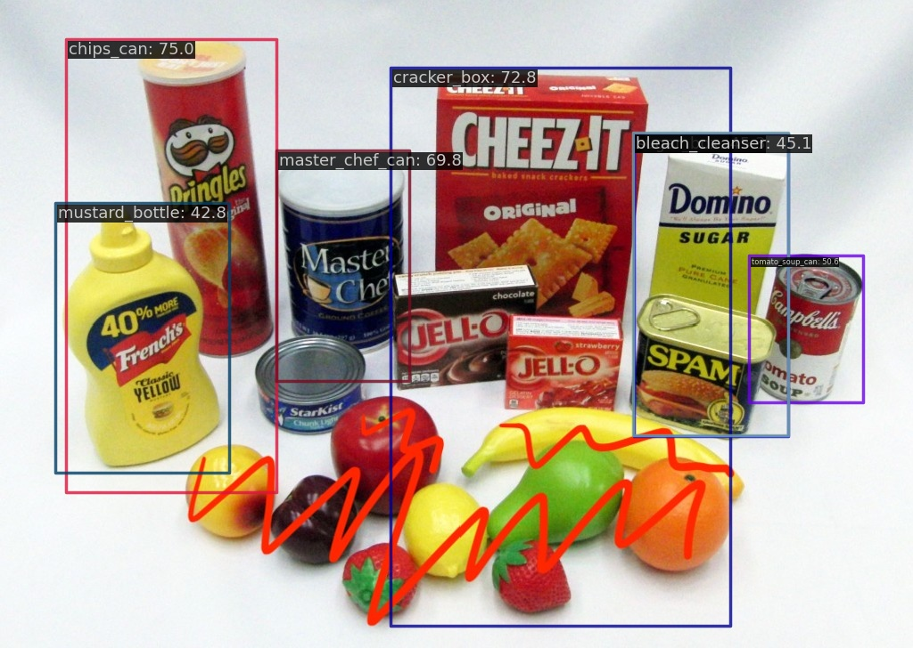

# MMDetection

Currently using MMDetection by OpenMMLab for object detection. 

## Conda Setup
A demo can be run on a test image after installing miniconda
and then importing the environment.yml by running:

```bash
conda env create -f environment.yml
conda activate openmmlab
```

## Detection Inference Demo on Model Trained on YCB Object Dataset

After the conda environment has been setup. 

```bash
cd mmdetection
```

You should now be able to run:

```bash
python demo/image_demo.py images/test.jpeg configs/rtmdet/rtmdet_tiny_1xb4-20e_ycb.py --weights work_dirs/rtmdet_tiny_1xb4-20e_ycb/best_coco_bbox_mAP_epoch_20.pth --device cuda:0 --pred-score-thr 0.4

```

The output should be in the mmdetection/outputs/vis. It should look something like this. 



You can try this on a few other images in the images folder by replacing the image path. You can also try using different prediction score thresholds by changing the value at --pred-score-thr 